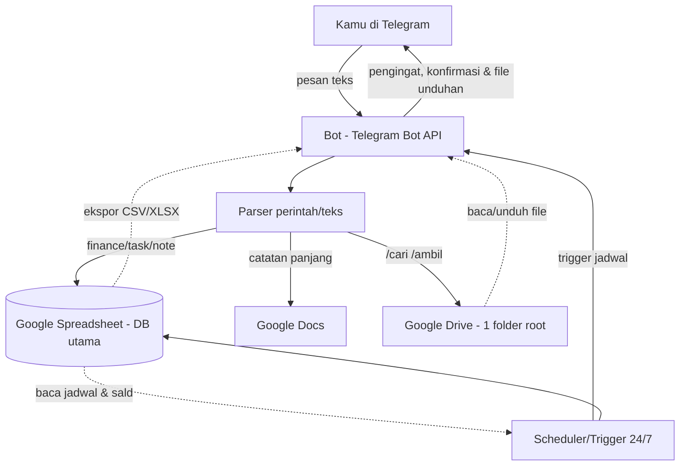

# PRD / SDD — Asisten Pribadi via Chat Bot

**Versi:** 0.2 (keputusan terkunci — siap dieksekusi)
**Tanggal:** 19 Juni 2026 (revisi dari draft 0.1, 16 Juni 2026)
**Status:** Keputusan inti sudah diputuskan — lihat §10. Sisa item terbuka ditandai eksplisit.

> Dokumen ini sengaja dibuat skeptis. Setiap fitur "otomatis" diturunkan jadi mekanik konkret. Yang tidak bisa diturunkan, ditandai sebagai *belum siap dibangun*.

---

## 1. Ringkasan & Tujuan

Sebuah bot chat (1 pengguna: kamu sendiri) yang dipakai sebagai **antarmuka tangkap-cepat** untuk mencatat keuangan, catatan/kebutuhan, dan tugas, lalu mengirim **pengingat terjadwal**. Data disimpan terstruktur di Google Sheets/Docs/Drive.

**Tujuan terukur (3 bulan pertama):**
- T1: ≥ 80% hari dalam sebulan ada minimal 1 entri keuangan yang tercatat lewat bot.
- T2: Pengingat terkirim tepat waktu ≥ 95% (toleransi ±5 menit).
- T3: Waktu dari "niat catat" sampai "tersimpan" < 10 detik.

**Bukan tujuan (eksplisit di luar lingkup v1):**
- Bukan financial advisor / kategorisasi cerdas otomatis.
- Bukan meal planner (sekadar pengingat statis, bukan rekomendasi makanan).
- Bukan "otomatisasi pekerjaan" umum — lihat §7.

---

## 2. Keputusan Arsitektur Utama (hasil dari analisis risiko)

| Keputusan | Pilihan | Alasan |
|---|---|---|
| Channel chat | **Telegram dulu, WhatsApp ditunda** | Telegram Bot API gratis, boleh kirim pesan proaktif, tanpa approval template. WhatsApp Cloud API melarang pesan proaktif di luar jendela 24 jam tanpa template berbayar yang harus di-approve; library tidak resmi (Baileys/whatsapp-web.js) melanggar ToS → risiko nomor diblokir. |
| Sumber kebenaran (source of truth) | **1 Google Spreadsheet** sebagai DB utama | Mencegah konflik sinkronisasi antar 4 storage. Drive untuk file/lampiran, Docs untuk catatan panjang. |
| Dropbox | **Ditunda** | Redundan dengan Drive. Tambah satu OAuth + satu titik gagal tanpa manfaat jelas di v1. |
| Penjadwal pengingat | **Trigger Apps Script** (server Google, bukan laptop/VPS) | Laptop tidur = pengingat mati; VPS = biaya + kelola server. Trigger Apps Script jalan 24/7 di server Google, gratis. |
| Build approach | **Apps Script + Telegram** (keputusan final, lihat §9) | Gratis; scheduler tanpa server; **menghapus risiko OAuth §8 #1** karena skrip jalan sebagai akun Google milikmu sendiri (tanpa refresh-token user yang kedaluwarsa 7 hari). Migrasi ke Node/VPS mudah jika nanti perlu. |

---

## 3. Arsitektur Sistem (SDD)



**Komponen:**
1. **Bot listener** — terima update dari Telegram via webhook (Apps Script Web App URL `doPost`).
2. **Parser** — ubah teks perintah → record terstruktur (lihat §5).
3. **Storage adapter** — tulis/baca Google Sheets (akses langsung via `SpreadsheetApp` di Apps Script; tanpa OAuth user).
4. **Scheduler** — trigger Apps Script berbasis waktu yang membaca tabel `Jadwal`/`Tugas` dan mengirim pengingat.
5. **Heartbeat** — trigger harian kirim 1 pesan `✅ alive` ke chat-mu tiap pagi. Tidak ada pesan = sistem mati, kamu sadar (menutup risiko §8 #3).
6. **Idempotensi pengingat** — sebelum kirim, cek kolom `terkirim_pada`; isi setelah terkirim agar satu pengingat tidak terkirim 2× saat trigger overlap/retry.

> Catatan auth: dengan Apps Script untuk Sheets, **tidak ada refresh-token user yang perlu disimpan** — skrip terotorisasi sekali sebagai akunmu. Auth store baru relevan jika nanti pindah ke Node/VPS atau menambah Drive/Docs (Fase 4).

---

## 4. Lingkup Fitur (MVP → bertahap)

**Fase 0 — Fondasi (wajib lebih dulu):**
- Setup bot Telegram + OAuth Google + 1 Spreadsheet dengan sheet: `Keuangan`, `Tugas`, `Catatan`, `Jadwal`, `Log`.

**Fase 1 — Tangkap (capture):**
- `/catat <teks>` → simpan ke `Catatan`.
- `/keluar <nominal> <kategori> [keterangan]` → simpan ke `Keuangan` sebagai pengeluaran.
- `/masuk <nominal> <kategori> [keterangan]` → simpan ke `Keuangan` sebagai pemasukan.
  (format **terstruktur**, bukan NLP bebas — lihat §5).
- `/tugas <teks> [#tanggal]` → simpan ke `Tugas`.

**Fase 2 — Pengingat:**
- Pengingat harian tetap (olahraga, makan, dll.) dari sheet `Jadwal`.
- Pengingat tugas berdasarkan tanggal jatuh tempo.
- **Reminder follow-up** tugas yang lewat tenggat — dikejar ulang sampai ditandai selesai (otomatisasi §7(c); murah begitu scheduler hidup, jadi masuk di sini).

**Fase 3 — Ringkasan, Laporan & Ambil/Unduh Data:**
- `/ringkas minggu` → total pengeluaran per kategori minggu ini.
- `/ringkas tugas` → tugas belum selesai.
- **Laporan harian otomatis** (§7(a)) — template terisi dari sheet, dikirim tiap pagi/malam. *Ditaruh di sini, bukan lebih awal: laporan hanya berguna kalau data capture sudah terbukti konsisten terisi (setelah lolos gate 2-minggu). Dibangun terlalu dini = laporan kosong.*
- **Ambil & unduh data/file** (§7B) — `/cari`, `/ambil`, `/lihat`, `/ekspor`. Cari & unduh dari Drive, preview teks di chat, + ekspor isi sheet jadi file unduhan via Telegram. *Aman di v1 karena Apps Script jalan sebagai akunmu (lihat §7B & koreksi §8).*

**Fase 4 (opsional, butuh validasi lagi):** Google Docs untuk catatan panjang; **auto-arsip lampiran ke Drive** (§7(b), fitur *tulis* — ditunda karena disiplin lingkup, bukan OAuth); WhatsApp; Dropbox (§7B catatan).

---

## 5. Spesifikasi Data & Parsing (titik paling rapuh — dibikin eksplisit)

**Keputusan: input keuangan pakai format perintah, BUKAN bahasa natural bebas.**
Alasan: parsing "tadi beli kopi 25rb di indomaret" rawan salah kategori/nominal → spreadsheet jadi sampah. Format perintah = validasi mudah, error cepat ketahuan.

**Konvensi tanda nominal (FINAL): tidak pakai tanda minus.** Arah uang ditentukan oleh perintah, bukan tanda. Ini menghindari ambiguitas dan salah ketik saat input cepat di HP. Nominal **selalu angka positif**.

Contoh:
```
/keluar 25000 makan kopi pagi
/masuk 500000 gaji freelance
```

Skema sheet `Keuangan`: `timestamp | tipe(masuk/keluar) | nominal | kategori | keterangan | sumber(bot)`
→ kolom `tipe` diisi otomatis oleh perintah (`/keluar`→keluar, `/masuk`→masuk); `nominal` selalu positif.

Skema sheet `Jadwal`: `id | label | waktu(HH:MM) | hari(mon-sun/daily) | aktif(y/n) | terkirim_pada`
Skema sheet `Tugas`: `id | teks | jatuh_tempo | status(open/done) | terkirim_pada`
→ kolom `terkirim_pada` dipakai untuk idempotensi pengingat (lihat §3 komponen #6).

**Validasi wajib:** nominal harus angka positif; kategori dari daftar tetap (tolak jika tidak dikenal, jangan diam-diam simpan salah).

---

## 6. Persyaratan Non-Fungsional

- **Keamanan:** refresh token Google jangan di kode/plaintext. Bot Telegram hanya merespons chat ID milikmu (whitelist) — kalau tidak, siapa pun yang menemukan bot bisa menulis ke datamu.
- **Keandalan pengingat:** scheduler harus punya retry + log; jika gagal kirim, catat di sheet `Log`. Idempotensi via kolom `terkirim_pada` (§3 #6) mencegah kirim ganda. Heartbeat harian (§3 #5) mendeteksi scheduler mati.
- **Ketahanan OAuth:** lihat §8 (token Google expired di mode testing).
- **Biaya:** hosting scheduler 24/7 (VPS murah / serverless cron). Telegram gratis. Google API gratis dalam kuota normal 1 pengguna.

---

## 7. "Otomatisasi Pekerjaan" — diturunkan jadi konkret

Frasa "pekerjaan saya secara otomatis" **tidak bisa dibangun** apa adanya. Yang nyata dan urutan eksekusinya (FINAL):
- (c) **Reminder follow-up tugas lewat tenggat** → **Fase 2** (paling murah, masuk paling awal).
- (a) **Template laporan harian terisi dari sheet** → **Fase 3** (setelah data capture terbukti konsisten via gate 2-minggu; sebelum itu = laporan kosong).
- (b) **Auto-arsip lampiran ke Drive** → **Fase 4 / ditunda** (butuh OAuth Drive = risiko §8 #1 yang sengaja dihindari).

Apa pun di luar pola "trigger → aturan tetap → aksi" (mis. mengerjakan tugas kognitif menggantikan kamu) = proyek terpisah, bukan v1.

**Extensibility (penambahan di masa depan):** desain ini sengaja dipilih agar mudah ditambah — perintah baru = 1 handler di parser; otomatisasi baru = 1 trigger + 1 aturan. Penambahan sistem nanti **tidak dibangun sekarang**, tapi arsitektur (Apps Script + format perintah) tidak menghalanginya. Setiap ide baru harus tetap lolos uji pola "trigger → aturan tetap → aksi" sebelum masuk lingkup.

---

## 7B. Ambil & Unduh Data/File (Fase 3)

Kebutuhan: bot bisa **mengambil data**, **menampilkannya di chat**, dan **mengirimkannya sebagai file yang bisa diunduh**. Sumber: **Google Drive** (bukan Dropbox — lihat catatan di bawah).

**Perintah:**
| Perintah | Aksi |
|---|---|
| `/cari <kata>` | Cari file di **1 folder Drive tertentu** (root yang kamu tetapkan), tampilkan daftar bernomor: `nama · tanggal · ukuran`. |
| `/ambil <nomor>` | Kirim file dari hasil `/cari` ke Telegram sebagai dokumen (bisa diunduh). Jika > 50 MB → kirim **tautan share Drive** sebagai gantinya. |
| `/lihat <nomor>` | **Preview isi file langsung di chat** (potongan teks). Hanya untuk file teks: Google Docs, `.txt`, `.csv`, `.md`. Dipotong ke ~3.000 karakter pertama (batas pesan Telegram 4.096); sisanya → saran pakai `/ambil`. |
| `/ekspor <sheet> [periode]` | Ekspor isi sheet (mis. `keuangan bulan-ini`) jadi **CSV/XLSX**, kirim sebagai file unduhan. |

**Mekanik (Apps Script):**
1. `/cari` → `DriveApp.getFolderById(DRIVE_ROOT_FOLDER_ID).searchFiles(...)`; simpan pemetaan `nomor → fileId` di `CacheService` per sesi (agar `/ambil <nomor>` tahu file mana).
2. `/ambil` → `file.getBlob()` → `UrlFetchApp.fetch` ke `sendDocument` (multipart). Cek ukuran dulu; > 50 MB → kirim `file.getUrl()`.
3. `/ekspor` → bangun CSV dari range sheet **atau** ambil export-URL XLSX → kirim sebagai blob.
4. `/lihat` → cek MIME type dulu; jika teks (Docs/`.txt`/`.csv`/`.md`) → ambil teks, potong ~3.000 karakter, kirim sebagai pesan. **Tidak didukung: PDF, gambar, biner** → balas "tidak bisa dipratinjau, pakai `/ambil`". Jangan coba render — itu di luar lingkup.

**Batasan & validasi (eksplisit):**
- **Pencarian dibatasi 1 folder root** (`DRIVE_ROOT_FOLDER_ID`) — supaya tidak membongkar seluruh Drive dan tetap aman. File ID di luar folder itu **ditolak**.
- **Whitelist chat ID** (§6) tetap berlaku — hanya kamu yang bisa menarik file.
- **Limit Telegram Bot API = 50 MB** per dokumen. Lebih besar → tautan, bukan unggah.
- **Apps Script:** timeout eksekusi 6 menit & batas payload UrlFetch ~50 MB — kebetulan selaras dengan limit Telegram, jadi bukan kendala tambahan.

**Klarifikasi OAuth (penting):** akses Drive di sini **tidak** kena risiko §8 #1. Itu khusus OAuth app eksternal yang menyimpan refresh-token user. Apps Script terikat ke akunmu → otorisasi sekali saat deploy, tanpa expiry 7-hari, tanpa verifikasi Google (verifikasi hanya untuk distribusi ke user lain). **Karena itu fitur ini aman di v1/Fase 3.**

**Kenapa Drive, bukan Dropbox:** Dropbox tetap **ditunda** (konsisten §2) — menambah satu OAuth lagi + redundan dengan Drive, tanpa manfaat jelas untuk 1 pengguna. Jika suatu saat file penting memang hidup di Dropbox, ini jadi pekerjaan Fase 4 dengan biaya OAuth tambahan — bukan default.

---

## 8. Risiko Teknis Spesifik (yang sering bikin proyek mati)

1. **OAuth Google "testing mode"** → refresh token kedaluwarsa tiap 7 hari. Untuk stabil, app harus pindah ke "production" + verifikasi Google untuk scope sensitif (Drive/Docs). Ini proses berhari-hari, bukan menit.
2. **WhatsApp** — jendela 24 jam + approval template + biaya per pesan template; library tak resmi = risiko ban. (Sebab ditunda.)
3. **Scheduler mati diam-diam** → pengingat hilang tanpa kamu sadar; butuh heartbeat/log.
4. **Data gap** → jika sebulan bolong logging, ringkasan keuangan jadi tak berguna; perlu cara isi-mundur (`/keluar ... #kemarin`).

5. **File terlalu besar untuk Telegram** → Bot API menolak dokumen > 50 MB. Mekanik `/ambil` (§7B) harus cek ukuran lebih dulu dan jatuh ke tautan share Drive, bukan gagal diam-diam.

**Catatan revisi 0.2 (koreksi):** risiko #1 (OAuth testing mode) **dimitigasi** oleh keputusan Apps Script — skrip jalan sebagai akunmu, otorisasi sekali, tanpa refresh-token user 7-hari. Ini berlaku **untuk Sheets *dan* Drive** (baca/unduh, §7B): keduanya hanya butuh otorisasi sekali, bukan token yang kedaluwarsa. Risiko #1 kembali relevan **hanya** jika pindah ke OAuth app eksternal (Node/VPS) atau mendistribusikan app ke user lain. Verifikasi Google untuk scope sensitif = soal *distribusi*, bukan pemakaian pribadi.

---

## 9. Build vs No-Code (penentu effort, harus diputuskan)

**KEPUTUSAN FINAL: Apps Script + Telegram.** Alasan spesifik untuk kasus ini (1 pengguna, mulai dari Sheets, butuh scheduler 24/7): gratis, scheduler tanpa server, dan **menghapus risiko OAuth §8 #1**. Gate 2-minggu jadi murah — kalau ternyata tidak dipakai, tidak ada biaya VPS/setup yang hangus. Migrasi ke Node/VPS mudah bila nanti perlu (logikanya sederhana).

| Opsi | Cocok jika | Effort kasar | Status |
|---|---|---|---|
| **Apps Script + Telegram** | gratis, semua di ekosistem Google, jadwal pakai trigger Apps Script | rendah–sedang | ✅ **DIPILIH** |
| n8n / Make (no-code) | tidak mau koding, mau visual, siap bayar/hosting n8n | sedang | ditolak (biaya + OAuth tetap ada) |
| Kode sendiri (Python/Node + VPS) | kamu bisa koding, mau kontrol penuh | sedang–tinggi | ditunda (opsi migrasi nanti) |

---

## 10. Asumsi & Keputusan Terbuka (validasi sebelum membangun)

- [x] **Pengguna tunggal** (cuma kamu). Multi-user mengubah auth & keamanan total. → **dikonfirmasi.**
- [x] Channel utama **Telegram** disetujui; WhatsApp **ditunda** (§2, §8 #2).
- [x] Source of truth **1 Spreadsheet** diterima; Dropbox **dibuang dari v1** (§2).
- [x] Input keuangan **format perintah** (bukan NLP bebas) diterima; konvensi `/keluar` & `/masuk`, nominal positif (§5).
- [x] Jalur build: **Apps Script + Telegram** (§9).
- [x] Otomatisasi: **(c) reminder follow-up** (Fase 2), **(a) laporan harian** (Fase 3), **(b) auto-arsip** (Fase 4/ditunda) — §7.

**Masih terbuka (untuk nanti, tidak memblokir mulai):**
- [ ] Daftar tetap **kategori keuangan** — perlu ditetapkan sebelum/saat Fase 1 (dipakai validasi §5).
- [ ] Daftar awal isi sheet **`Jadwal`** (pengingat harian apa saja).
- [ ] Jam kirim **laporan harian** & **heartbeat** (mis. heartbeat 07:00).
- [ ] **`DRIVE_ROOT_FOLDER_ID`** — folder Drive tunggal yang boleh dicari/diunduh oleh `/cari` & `/ambil` (§7B). Ditetapkan saat Fase 3.

---

## 11. Rencana Bertahap

- **Minggu 1:** Fase 0 (setup Apps Script + bot Telegram + Spreadsheet + sheet) + Fase 1 (capture: `/keluar` `/masuk` `/tugas` `/catat`). Pasang heartbeat harian sejak awal.
- **Minggu 1–2:** pakai 2 minggu untuk uji apakah kamu benar-benar memakai capture.
- **Gate keputusan:** jika capture dipakai konsisten 2 minggu → lanjut Fase 2. Jika tidak → masalahnya bukan tooling, **hentikan/perkecil** (jangan tambah fitur).
- **Minggu 3–4:** Fase 2 — pengingat harian + pengingat tugas + reminder follow-up (§7c).
- **Bulan 2:** Fase 3 — ringkasan + laporan harian otomatis (§7a). Evaluasi apakah Fase 4 (Drive/auto-arsip, WhatsApp) layak.
