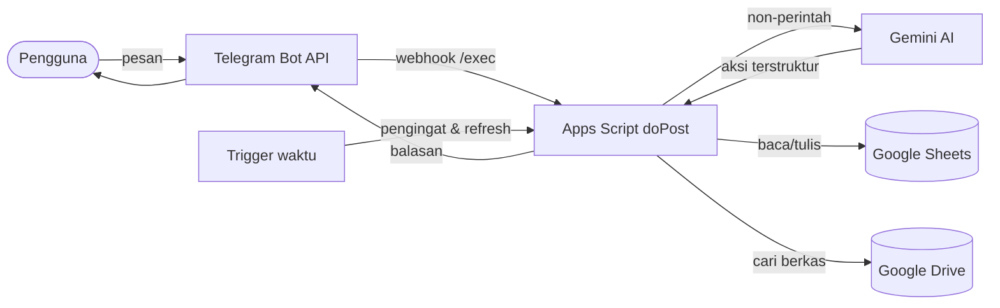

<h1 align="center">🤖 Asisten Pribadi — Telegram Bot</h1>

<p align="center">
  Asisten keuangan & produktivitas pribadi lewat chat Telegram, ditenagai Google Apps Script + Gemini AI.<br>
  Catat pengeluaran, tugas, dan catatan cukup dengan mengetik bahasa sehari-hari.
</p>

<p align="center">
  
  
  
  
  
</p>

---

## ✨ Fitur

- 💸 **Catat keuangan** — `/keluar` & `/masuk` dengan kategori, keterangan, dan **backfill tanggal** (`#kemarin`, `#2026-06-18`).
- 🧠 **Bahasa natural (AI)** — ketik bebas tanpa perintah, mis. *"tadi jajan kopi 25rb"*. Gemini menafsirkan → bot konfirmasi → simpan. Menjaga data tetap bersih.
- 📋 **Tugas & catatan** — buat tugas dengan tenggat, lihat daftar, tandai selesai, simpan catatan bebas.
- ⏰ **Pengingat otomatis** — jadwal harian/mingguan + pengingat tenggat tugas, lewat trigger waktu.
- 📊 **Dashboard keuangan** — sheet ringkasan modern (kartu, pie chart, perbandingan bulan lalu) yang **ter-update otomatis** tiap transaksi.
- 🔎 **Pencarian berkas Drive** — `/cari` menelusuri folder Drive (rekursif) dan mengembalikan tautan yang bisa diklik.
- 🧾 **Rekap, edit & hapus** — ringkasan bulanan, perbaiki entri salah input, hapus per entri atau per bulan (dengan konfirmasi).
- 🔐 **Privat 1-pengguna** — hanya merespons chat ID Anda; pesan dari orang lain diabaikan diam-diam.

## 💬 Cara pakai

Semua perintah juga bisa diketik **tanpa garis miring** (lewat AI). Contoh:

| Perintah | Bahasa natural | Fungsi |
|---|---|---|
| `/keluar 25000 makan kopi` | *"jajan kopi 25rb"* | Catat pengeluaran |
| `/masuk 5000000 gaji` | *"gaji masuk 5jt"* | Catat pemasukan |
| `/keluar 20000 makan #kemarin` | *"kemarin makan 20rb"* | Catat dengan tanggal lampau |
| `/tugas bayar listrik #2026-06-25` | *"ingatkan bayar listrik besok"* | Buat tugas + tenggat |
| `/daftar` | *"ada tugas apa saja"* | Lihat tugas yang belum selesai |
| `/selesai T-0001` | *"tugas T-0001 selesai"* | Tandai tugas selesai |
| `/catat ide weekend` | *"catat: ide weekend"* | Simpan catatan |
| `/cari laporan` | *"cari file laporan"* | Cari berkas di Drive |
| `/rekap` · `/rekap 2026-05` | *"rekap keuangan bulan ini"* | Ringkasan bulanan |
| `/edit terakhir nominal 30000` | *"ubah nominal terakhir jadi 30rb"* | Perbaiki entri |
| `/hapus terakhir` · `/hapus bulan 2026-05` | *"hapus transaksi terakhir"* | Hapus entri (konfirmasi) |

> Aksi yang menyimpan atau menghapus selalu meminta konfirmasi `/ya` atau `/tidak` lebih dulu.

## 🏗️ Arsitektur



- **Sumber kebenaran** = satu Google Spreadsheet (sheet `Keuangan`, `Tugas`, `Catatan`, `Jadwal`, `Kategori`, `Log`).
- **Webhook** berjalan sebagai akun Anda; rahasia (token bot, API key) disimpan di **Script Properties**, bukan di kode.

## 📂 Struktur

```
.
├── apps-script/
│   ├── Main.gs          # entry webhook (doPost) + gerbang whitelist
│   ├── Router.gs        # parsing & dispatch perintah
│   ├── Commands.gs      # /keluar /masuk /tugas /catat /selesai /cari
│   ├── Rekap.gs         # /rekap /daftar /edit /hapus
│   ├── AI.gs            # lapisan bahasa natural (Gemini)
│   ├── Dashboard.gs     # dashboard keuangan (dihitung di JS, anti-locale)
│   ├── Scheduler.gs     # heartbeat, pengingat, trigger
│   ├── Drive.gs         # pencarian berkas Drive (rekursif)
│   ├── Validate.gs      # parsing nominal/tanggal/kategori
│   ├── Sheets.gs        # adapter spreadsheet + Log
│   ├── Telegram.gs      # Bot API (sendMessage, setWebhook)
│   ├── Config.gs        # baca Script Properties
│   ├── Setup.gs         # skrip setup sekali-jalan
│   ├── appsscript.json  # manifest Web App
│   └── README.md        # 📖 panduan setup & deploy langkah demi langkah
├── PRD-SDD-Asisten-Pribadi.md   # spesifikasi produk & desain
└── DESAIN-DAN-TASK.md           # desain teknis & daftar tugas
```

## 🚀 Instalasi

Bot ini berjalan di **Google Apps Script** (gratis, tanpa server). Ringkasnya:

1. Buat bot via **@BotFather**, ambil token & chat ID Anda.
2. Buat Google Spreadsheet + proyek Apps Script, tempel berkas `apps-script/*.gs`.
3. Isi Script Properties (token, chat ID, spreadsheet ID, Gemini API key).
4. Deploy sebagai **Web App** (`/exec`) lalu daftarkan webhook.

👉 **Panduan lengkap langkah demi langkah:** [`apps-script/README.md`](apps-script/README.md)

## 🛠️ Teknologi

| Komponen | Teknologi |
|---|---|
| Runtime | Google Apps Script (V8) |
| Antarmuka | Telegram Bot API (webhook) |
| Database | Google Sheets |
| AI | Google Gemini (`gemini-2.5-flash`, tier gratis) |
| Berkas | Google Drive |
| Penjadwalan | Apps Script time-based triggers |

## 🔐 Keamanan & privasi

- **Akses dibatasi** ke satu `ALLOWED_CHAT_ID`; update dari chat lain ditolak diam-diam ([`Main.gs`](apps-script/Main.gs)).
- **Tidak ada rahasia di repo** — token & API key hanya hidup di Script Properties; `.gitignore` menutup berkas sensitif.
- **Catatan AI:** tier gratis Gemini dapat memakai input untuk peningkatan produk Google — pertimbangkan ini untuk data keuangan pribadi.

## 🗺️ Roadmap

- [x] Capture keuangan/tugas/catatan + validasi
- [x] Pengingat jadwal & tugas
- [x] Pencarian berkas Drive
- [x] Lapisan AI bahasa natural (Gemini)
- [x] Dashboard keuangan auto-update
- [x] Rekap, edit, hapus, backfill tanggal
- [ ] Edit entri lama (perlu kolom ID di Keuangan/Catatan)
- [ ] Integrasi Dropbox
- [ ] Ekspansi ke WhatsApp / auto-arsip

## 📄 Lisensi

Proyek pribadi untuk penggunaan sendiri. Silakan dijadikan referensi.

---

<p align="center"><sub>Dibuat untuk dipakai sehari-hari — bukan demo. 🇮🇩</sub></p>
